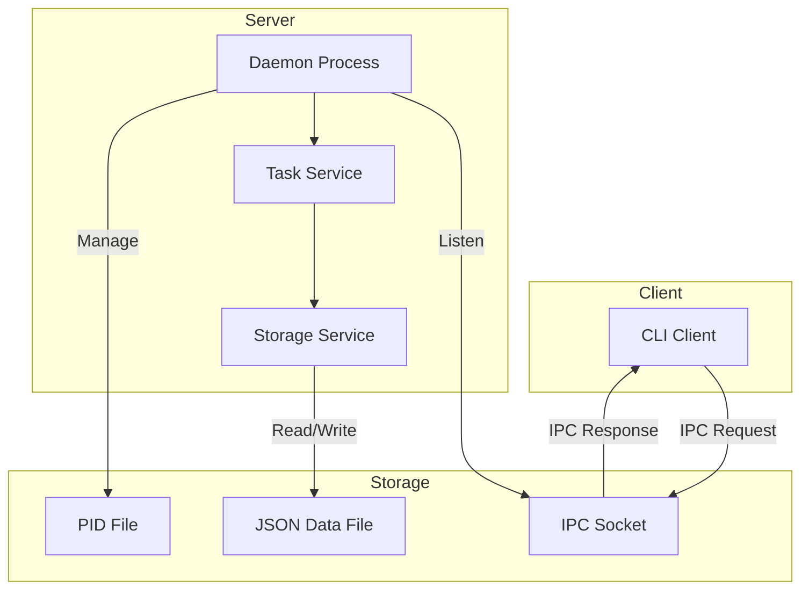
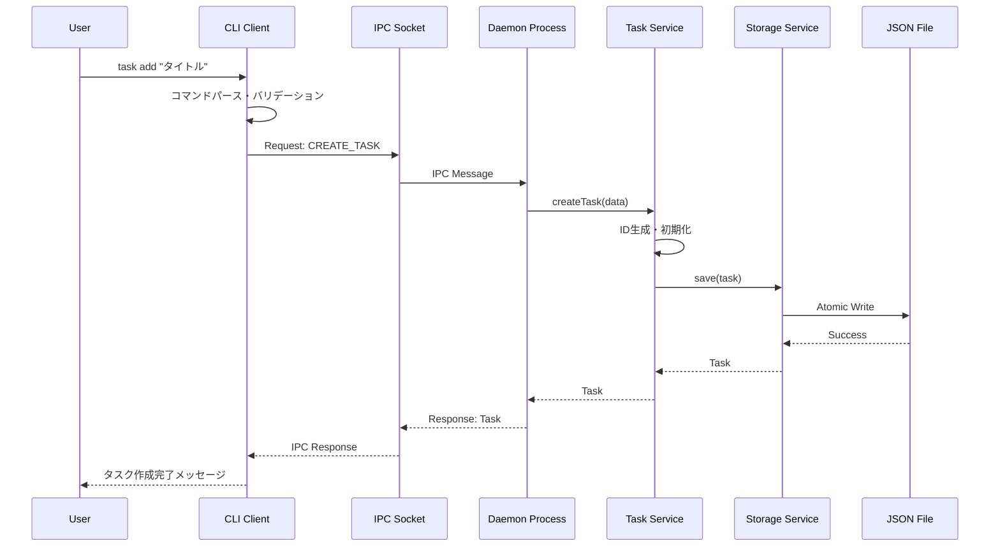
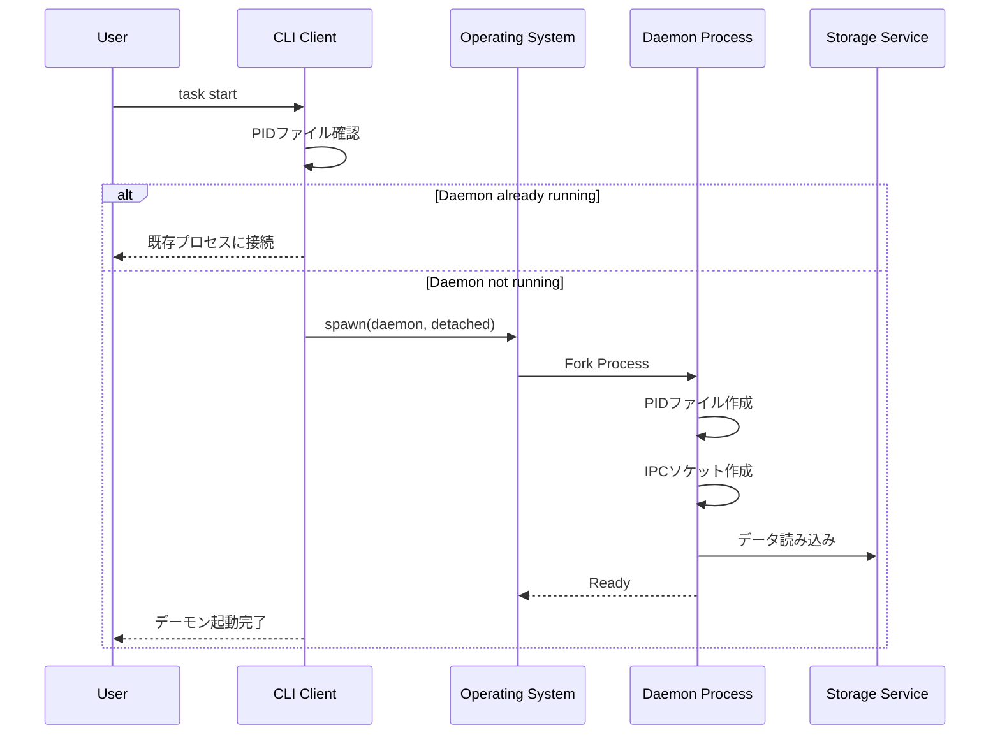
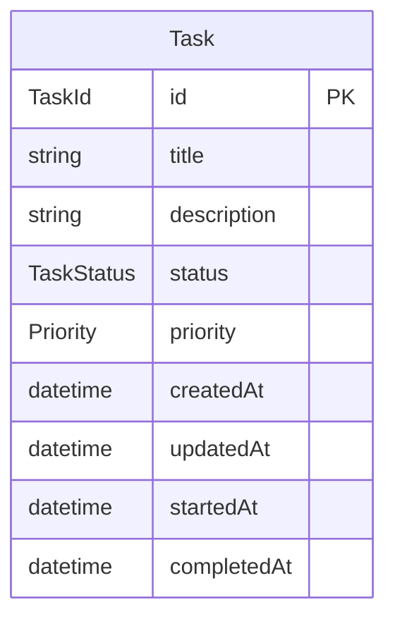

# Design Document: cli-task-manager

## Overview
**Purpose**: CLIベースのタスク管理ツールを提供し、ユーザーがローカル環境でタスクを効率的に管理できるようにする。

**Users**: 開発者やパワーユーザーがターミナルからタスクの作成・管理・追跡を行うワークフローで使用する。

**Impact**: 新規プロジェクトとしてゼロから構築。常駐プロセスとCLIクライアントの2コンポーネント構成。

### Goals
- CLIからタスクのCRUD操作を提供する
- 常駐プロセスとしてバックグラウンドで動作する
- ローカルファイルシステムにデータを永続化する
- クロスプラットフォーム（macOS、Linux、Windows）で動作する

### Non-Goals
- Webインターフェースの提供（今回の開発対象外、将来拡張として検討予定）
- クラウド同期・マルチデバイス対応
- チーム共有機能
- リマインダー・通知機能

## Architecture

### Architecture Pattern & Boundary Map



**Architecture Integration**:
- **Selected pattern**: Client-Server（IPC通信）- 常駐プロセス要件に適合し、状態管理と排他制御が容易
- **Domain/feature boundaries**: CLI Client（ユーザーインターフェース）/ Daemon Server（ビジネスロジック + データ管理）
- **New components rationale**:
  - CLI Client: ユーザーコマンドのパース・送信
  - Daemon Process: IPC通信ハンドリング・ライフサイクル管理
  - Task Service: タスクドメインロジック
  - Storage Service: データ永続化抽象化

### Technology Stack

| Layer | Choice / Version | Role in Feature | Notes |
|-------|------------------|-----------------|-------|
| Frontend / CLI | Commander.js ^14.0.0 | サブコマンドパース、ヘルプ生成 | 最軽量、サブコマンドネイティブ |
| Backend / Services | Node.js ^20.0.0 + TypeScript ^5.0.0 | ランタイム、型安全性 | ESM対応、LTS |
| Data / Storage | JSON File（自前実装） | タスクデータ永続化 | 依存最小、可読性重視 |
| Messaging / Events | Unix Domain Socket / Named Pipe | クライアント-サーバーIPC | 最速、ローカル専用 |
| Infrastructure / Runtime | child_process（Node.js組み込み） | プロセス管理 | 外部依存なし |

## System Flows

### タスク作成フロー



### デーモン起動フロー



## Requirements Traceability

| Requirement | Summary | Components | Interfaces | Flows |
|-------------|---------|------------|------------|-------|
| 1.1-1.5 | タスク作成 | CLI Client, Task Service | TaskService.create | タスク作成フロー |
| 2.1-2.5 | タスク一覧 | CLI Client, Task Service | TaskService.list | - |
| 3.1-3.5 | タスク更新 | CLI Client, Task Service | TaskService.update | - |
| 4.1-4.5 | ステータス管理 | Task Service | TaskService.updateStatus | - |
| 5.1-5.3 | タスク削除 | CLI Client, Task Service | TaskService.delete | - |
| 6.1-6.5 | データ永続化 | Storage Service | StorageService | - |
| 7.1-7.5 | 常駐プロセス | Daemon Process, CLI Client | DaemonManager | デーモン起動フロー |
| 8.1-8.5 | CLIインターフェース | CLI Client | Commander.js config | - |
| 9.1-9.3 | タスク検索 | CLI Client, Task Service | TaskService.search | - |
| 10.1-10.3 | エラーハンドリング | 全コンポーネント | Result型 | - |

## Components and Interfaces

| Component | Domain/Layer | Intent | Req Coverage | Key Dependencies | Contracts |
|-----------|--------------|--------|--------------|------------------|-----------|
| CLI Client | Presentation | ユーザーコマンド処理・表示 | 1, 2, 3, 5, 8, 9 | Commander.js (P0), IPC Client (P0) | Service |
| Daemon Process | Infrastructure | プロセスライフサイクル・IPC | 7, 10 | Node.js child_process (P0) | Service |
| Task Service | Domain | タスクビジネスロジック | 1, 2, 3, 4, 5, 9 | Storage Service (P0) | Service |
| Storage Service | Infrastructure | データ永続化 | 6 | fs (P0) | Service |
| IPC Client | Infrastructure | クライアント側通信 | 7 | net (P0) | Service |
| IPC Server | Infrastructure | サーバー側通信 | 7 | net (P0) | Service |

### Domain Layer

#### Task Service

| Field | Detail |
|-------|--------|
| Intent | タスクのCRUD操作とビジネスルール適用 |
| Requirements | 1.1-1.5, 2.1-2.5, 3.1-3.5, 4.1-4.5, 5.1-5.3, 9.1-9.3 |

**Responsibilities & Constraints**
- タスクの作成・読取・更新・削除
- ID生成と一意性保証
- ステータス遷移ルールの適用
- 検索・フィルタリング・ソート

**Dependencies**
- Outbound: Storage Service — データ永続化 (P0)

**Contracts**: Service [x]

##### Service Interface
```typescript
interface TaskService {
  create(input: CreateTaskInput): Result<Task, TaskError>;
  list(filter?: TaskFilter): Result<Task[], TaskError>;
  get(id: TaskId): Result<Task, TaskError>;
  update(id: TaskId, input: UpdateTaskInput): Result<Task, TaskError>;
  updateStatus(id: TaskId, status: TaskStatus): Result<Task, TaskError>;
  delete(id: TaskId): Result<void, TaskError>;
  search(query: string): Result<Task[], TaskError>;
}

interface CreateTaskInput {
  title: string;
  description?: string;
  priority?: Priority;
}

interface UpdateTaskInput {
  title?: string;
  description?: string;
  priority?: Priority;
}

interface TaskFilter {
  status?: TaskStatus;
  priority?: Priority;
  sortBy?: 'priority' | 'createdAt' | 'updatedAt';
  sortOrder?: 'asc' | 'desc';
}

type TaskError =
  | { type: 'NOT_FOUND'; taskId: TaskId }
  | { type: 'INVALID_STATUS'; status: string }
  | { type: 'VALIDATION_ERROR'; message: string }
  | { type: 'STORAGE_ERROR'; cause: Error };
```

- Preconditions: タスク作成時はtitleが必須かつ非空
- Postconditions: 作成後はタスクに一意のIDが割り当てられる
- Invariants: ステータスはpending/in_progress/completedのいずれか

### Infrastructure Layer

#### Storage Service

| Field | Detail |
|-------|--------|
| Intent | タスクデータのJSON形式での永続化 |
| Requirements | 6.1-6.5 |

**Responsibilities & Constraints**
- JSONファイルへの読み書き
- アトミック書き込み（データ破損防止）
- ファイル自動作成
- バックアップからの復元試行

**Dependencies**
- External: Node.js fs module — ファイル操作 (P0)

**Contracts**: Service [x]

##### Service Interface
```typescript
interface StorageService {
  load(): Result<TaskStore, StorageError>;
  save(store: TaskStore): Result<void, StorageError>;
  backup(): Result<void, StorageError>;
  restore(): Result<TaskStore, StorageError>;
}

interface TaskStore {
  version: string;
  tasks: Task[];
  metadata: StoreMetadata;
}

interface StoreMetadata {
  lastModified: string;
  taskCount: number;
}

type StorageError =
  | { type: 'FILE_NOT_FOUND' }
  | { type: 'CORRUPTED_DATA'; cause: Error }
  | { type: 'WRITE_ERROR'; cause: Error }
  | { type: 'BACKUP_NOT_FOUND' };
```

- Preconditions: ファイルパスが有効であること
- Postconditions: save後は即座にファイルに反映
- Invariants: データは常に有効なJSON形式

**Implementation Notes**
- アトミック書き込み: 一時ファイルに書き込み後、rename操作で置換
- ファイルパス: `~/.task-tools/data.json`
- バックアップ: `~/.task-tools/data.json.bak`

#### Daemon Process

| Field | Detail |
|-------|--------|
| Intent | バックグラウンドプロセスとして常駐しIPCリクエストを処理 |
| Requirements | 7.1-7.5 |

**Responsibilities & Constraints**
- バックグラウンドプロセスとしての起動・停止
- IPCソケットでのリクエスト受付
- PIDファイルによるプロセス管理
- グレースフルシャットダウン

**Dependencies**
- Outbound: Task Service — リクエスト処理 (P0)
- Outbound: IPC Server — 通信 (P0)
- External: Node.js child_process — プロセス管理 (P0)

**Contracts**: Service [x]

##### Service Interface
```typescript
interface DaemonManager {
  start(): Result<DaemonInfo, DaemonError>;
  stop(): Result<void, DaemonError>;
  status(): Result<DaemonStatus, DaemonError>;
  isRunning(): boolean;
}

interface DaemonInfo {
  pid: number;
  socketPath: string;
  startedAt: string;
}

type DaemonStatus =
  | { running: true; info: DaemonInfo }
  | { running: false };

type DaemonError =
  | { type: 'ALREADY_RUNNING'; pid: number }
  | { type: 'NOT_RUNNING' }
  | { type: 'START_FAILED'; cause: Error }
  | { type: 'STOP_FAILED'; cause: Error };
```

**Implementation Notes**
- PIDファイル: `~/.task-tools/daemon.pid`
- ソケットパス: `~/.task-tools/daemon.sock`（Unix）、`\\.\pipe\task-tools`（Windows）

#### IPC Communication

| Field | Detail |
|-------|--------|
| Intent | クライアント-サーバー間の高速通信 |
| Requirements | 7.2, 7.5 |

**Contracts**: Service [x]

##### Service Interface
```typescript
interface IPCClient {
  connect(): Result<void, IPCError>;
  disconnect(): void;
  send<T>(request: IPCRequest): Result<IPCResponse<T>, IPCError>;
}

interface IPCServer {
  listen(): Result<void, IPCError>;
  close(): void;
  onRequest(handler: RequestHandler): void;
}

interface IPCRequest {
  id: string;
  method: IPCMethod;
  params: Record<string, unknown>;
}

interface IPCResponse<T> {
  id: string;
  success: boolean;
  data?: T;
  error?: IPCResponseError;
}

type IPCMethod =
  | 'task.create'
  | 'task.list'
  | 'task.get'
  | 'task.update'
  | 'task.updateStatus'
  | 'task.delete'
  | 'task.search'
  | 'daemon.status'
  | 'daemon.stop';

type IPCError =
  | { type: 'CONNECTION_FAILED'; cause: Error }
  | { type: 'TIMEOUT' }
  | { type: 'SOCKET_ERROR'; cause: Error };

interface IPCResponseError {
  code: string;
  message: string;
}

type RequestHandler = (request: IPCRequest) => Promise<IPCResponse<unknown>>;
```

### Presentation Layer

#### CLI Client

| Field | Detail |
|-------|--------|
| Intent | ユーザーコマンドの解析と結果表示 |
| Requirements | 8.1-8.5 |

**Responsibilities & Constraints**
- コマンドライン引数のパース
- IPCリクエストの送信
- 結果のフォーマット表示
- エラーメッセージ表示

**Dependencies**
- External: Commander.js — コマンドパース (P0)
- Outbound: IPC Client — サーバー通信 (P0)

**Contracts**: Service [x]

##### CLI Commands
```
task-tools <command> [options]

Commands:
  start                     デーモンを起動
  stop                      デーモンを停止
  status                    デーモンの状態を表示
  add <title>               タスクを作成
  list [options]            タスク一覧を表示
  show <id>                 タスク詳細を表示
  update <id> [options]     タスクを更新
  done <id>                 タスクを完了にする
  delete <id>               タスクを削除
  search <query>            タスクを検索

Options:
  -d, --description <desc>  説明を指定
  -p, --priority <level>    優先度を指定 (low|medium|high)
  -s, --status <status>     ステータスでフィルター
  --sort <field>            ソートフィールド
  -h, --help                ヘルプを表示
  -v, --version             バージョンを表示
```

## Data Models

### Domain Model



**Entities**:
- **Task**: タスクエンティティ（集約ルート）

**Value Objects**:
- **TaskId**: タスク識別子（UUID v4）
- **TaskStatus**: ステータス列挙型
- **Priority**: 優先度列挙型

**Business Rules & Invariants**:
- タスクIDは作成時に自動生成され変更不可
- ステータス遷移: pending → in_progress → completed（逆方向も許可）
- in_progressへの遷移時にstartedAtを記録
- completedへの遷移時にcompletedAtを記録
- titleは必須かつ非空

### Logical Data Model

```typescript
type TaskId = string; // UUID v4

type TaskStatus = 'pending' | 'in_progress' | 'completed';

type Priority = 'low' | 'medium' | 'high';

interface Task {
  id: TaskId;
  title: string;
  description: string;
  status: TaskStatus;
  priority: Priority;
  createdAt: string;   // ISO 8601
  updatedAt: string;   // ISO 8601
  startedAt?: string;  // ISO 8601, in_progress時に設定
  completedAt?: string; // ISO 8601, completed時に設定
}
```

### Physical Data Model

**JSON File Structure** (`~/.task-tools/data.json`):
```json
{
  "version": "1.0.0",
  "tasks": [
    {
      "id": "550e8400-e29b-41d4-a716-446655440000",
      "title": "タスクタイトル",
      "description": "タスクの説明",
      "status": "pending",
      "priority": "medium",
      "createdAt": "2026-01-06T00:00:00.000Z",
      "updatedAt": "2026-01-06T00:00:00.000Z"
    }
  ],
  "metadata": {
    "lastModified": "2026-01-06T00:00:00.000Z",
    "taskCount": 1
  }
}
```

**File Locations**:
- データファイル: `~/.task-tools/data.json`
- バックアップ: `~/.task-tools/data.json.bak`
- PIDファイル: `~/.task-tools/daemon.pid`
- ソケット: `~/.task-tools/daemon.sock`

## Error Handling

### Error Strategy
Result型パターンを採用し、例外ではなく戻り値でエラーを表現する。

```typescript
type Result<T, E> =
  | { success: true; data: T }
  | { success: false; error: E };
```

### Error Categories and Responses

**User Errors (Validation)**:
- 空のタイトル → "タイトルは必須です"
- 無効なステータス → "有効なステータス: pending, in_progress, completed"
- 存在しないタスクID → "タスクが見つかりません: {id}"

**System Errors (Infrastructure)**:
- ファイル書き込み失敗 → "データの保存に失敗しました"
- ソケット接続失敗 → "デーモンに接続できません。`task-tools start`で起動してください"

**Business Logic Errors**:
- 無効なステータス遷移 → 現在は全遷移を許可（将来の拡張ポイント）

### Exit Codes
- 0: 成功
- 1: 一般エラー
- 2: コマンド構文エラー
- 3: 接続エラー（デーモン未起動）

## Testing Strategy

### Unit Tests
- TaskService: CRUD操作、ステータス遷移、検索ロジック
- StorageService: JSON読み書き、アトミック書き込み
- バリデーション: 入力値検証ロジック

### Integration Tests
- IPC通信: クライアント-サーバー間のリクエスト/レスポンス
- エンドツーエンドフロー: タスク作成→更新→削除
- デーモンライフサイクル: 起動→状態確認→停止

### E2E/CLI Tests
- 全サブコマンドの実行確認
- ヘルプ・バージョン表示
- エラーメッセージ表示

## Security Considerations

- **ローカル専用**: ネットワーク経由のアクセスは不可（Unix Domain Socket使用）
- **ファイルパーミッション**: データファイルは所有者のみ読み書き可能（0600）
- **入力サニタイズ**: JSONインジェクション防止（JSON.parse/stringifyのみ使用）

## Future Extension Points

> **Note**: 本セクションは将来の拡張可能性を示すものであり、今回の開発対象外です。

### ブラウザベースWebフロントエンド対応

現在のアーキテクチャはWebフロントエンド追加に対応可能な設計となっています。

**現在のレイヤー構成**:
```
CLI Client → IPC → Daemon → Task Service → Storage Service
```

**将来の拡張時**:
```
CLI Client  → IPC  → Daemon → Task Service → Storage Service
Web Frontend → HTTP →   ↑
```

**拡張時に必要な変更**:

| 項目 | 現在の実装 | 追加で必要な実装 |
|------|-----------|-----------------|
| 通信プロトコル | IPC (Unix Socket / Named Pipe) | HTTPサーバー追加（Express等） |
| 認証 | 不要（ローカルIPC） | localhost限定 or トークン認証 |
| CORS | N/A | 設定追加 |
| リアルタイム更新 | N/A | WebSocket（オプション） |

**現在の設計が拡張を容易にする理由**:
1. **Task Serviceの独立性**: ビジネスロジックがトランスポート層から分離されている
2. **統一されたインターフェース**: `TaskService`インターフェースをHTTPハンドラーから呼び出すだけで対応可能
3. **データモデルの共有**: 同一の`Task`型をREST APIレスポンスとして再利用可能

**拡張時の実装イメージ**:
```typescript
// 将来追加されるHTTPサーバー（参考）
// Daemon内でIPC Serverと並行して起動
interface HTTPServer {
  listen(port: number): void;
  close(): void;
}

// TaskServiceを共有して利用
// GET /api/tasks → taskService.list()
// POST /api/tasks → taskService.create()
```
