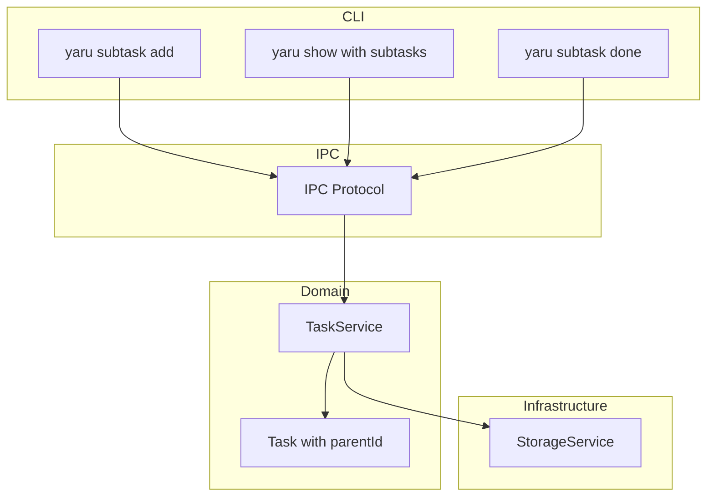
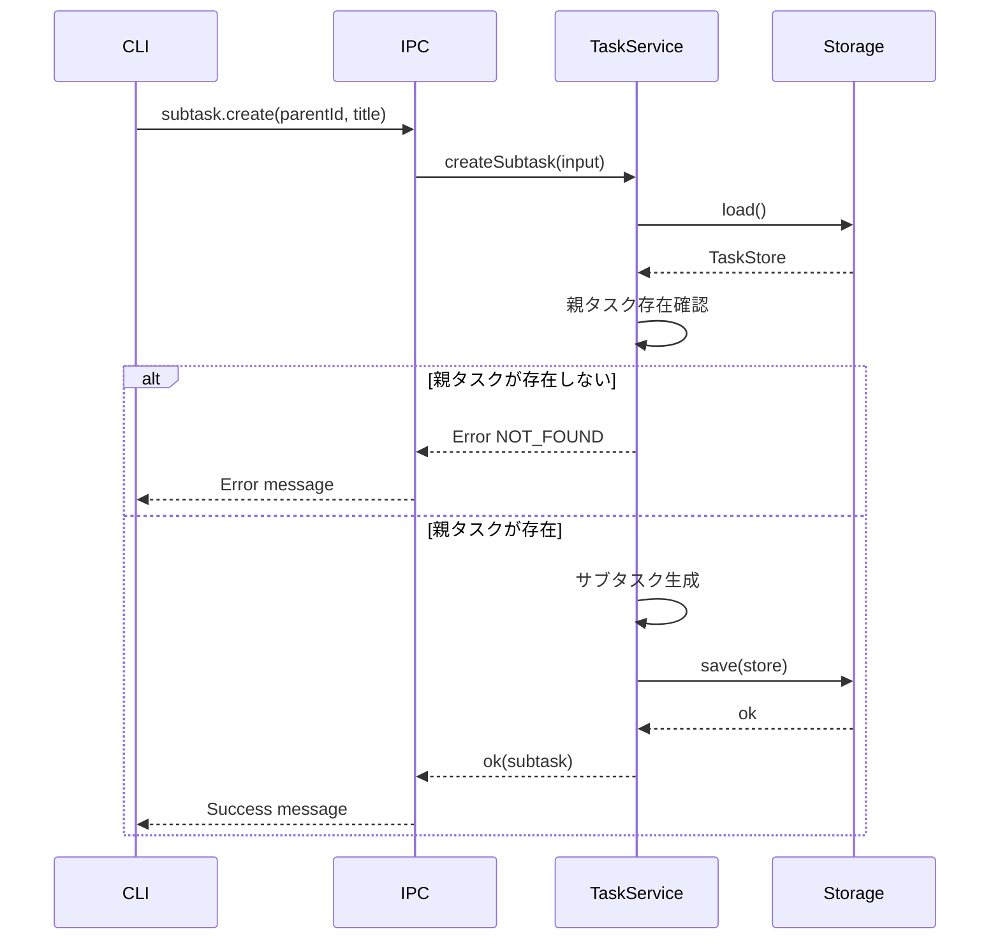
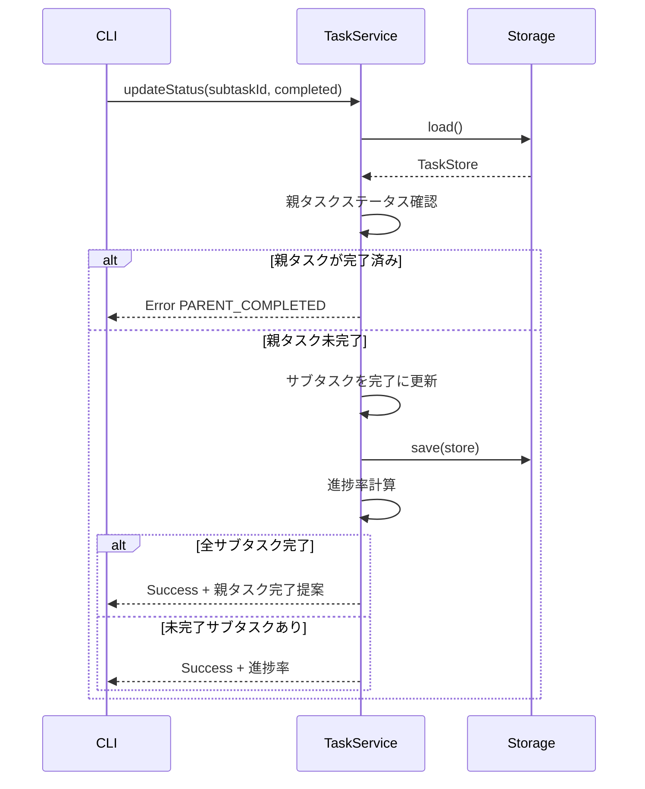
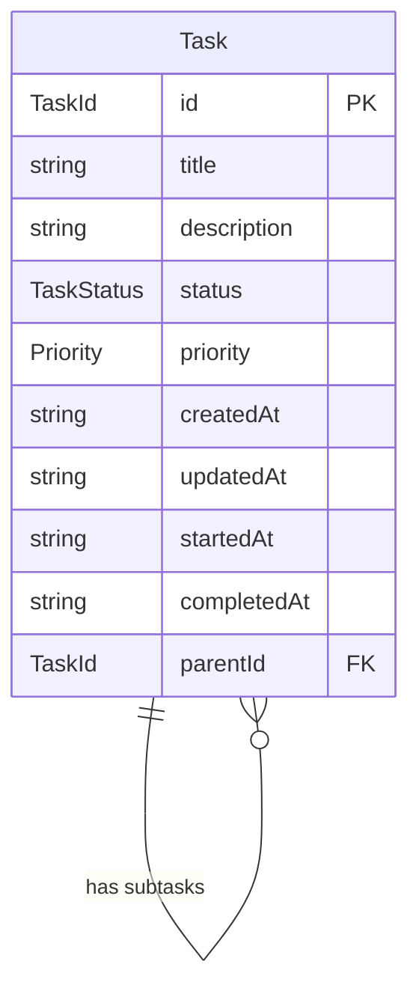

# Technical Design: subtasks-and-descriptions

## Overview

**Purpose**: yaruタスク管理CLIにサブタスク機能を追加し、複雑なタスクを階層的に管理できるようにする。

**Users**: CLIユーザーがタスクを細分化して進捗を追跡するために使用。

**Impact**: 既存Task型に`parentId`フィールドを追加し、TaskServiceに新規メソッドを追加。後方互換性を維持。

### Goals
- 親タスクに対してサブタスクを作成・編集・完了・削除できる
- サブタスクの完了状況から親タスクの進捗率を表示できる
- 既存のタスク操作は影響を受けない

### Non-Goals
- 多階層ネスト（サブタスクのサブタスク）は対象外
- サブタスク間の依存関係管理は対象外
- サブタスクのドラッグ&ドロップ並び替えは対象外

## Architecture

### Existing Architecture Analysis
- **現行パターン**: レイヤードアーキテクチャ（CLI → IPC → Domain → Storage）
- **ドメイン境界**: Task型がドメインモデルの中心、TaskServiceがビジネスロジックを担当
- **統合ポイント**: IPCプロトコルでCLIとデーモン間通信
- **維持すべき制約**: Result型によるエラーハンドリング、短縮ID検索

### Architecture Pattern & Boundary Map



**Architecture Integration**:
- **Selected pattern**: 既存レイヤードアーキテクチャを維持
- **Domain boundaries**: サブタスクは独立エンティティではなくTask型の拡張として扱う
- **Existing patterns preserved**: Result型、短縮ID検索、IPC通信
- **New components rationale**: 新コンポーネントは追加せず、既存コンポーネントを拡張

### Technology Stack

| Layer | Choice / Version | Role in Feature | Notes |
|-------|------------------|-----------------|-------|
| CLI | commander ^14.0.0 | サブタスク用サブコマンド追加 | 既存依存 |
| Domain | TypeScript 5.x | Task型拡張、TaskService拡張 | 既存依存 |
| Storage | JSON file | parentIdフィールド追加 | スキーマ変更不要 |

## System Flows

### サブタスク作成フロー



### サブタスク完了と進捗率計算フロー



## Requirements Traceability

| Requirement | Summary | Components | Interfaces | Flows |
|-------------|---------|------------|------------|-------|
| 1.1, 1.2, 1.3, 1.4 | サブタスク作成 | Task, TaskService | createSubtask | 作成フロー |
| 2.1, 2.2, 2.3 | サブタスク一覧・進捗表示 | TaskService, CLI | listSubtasks, getProgress | - |
| 3.1, 3.2, 3.3 | サブタスク編集 | TaskService | update | - |
| 4.1, 4.2, 4.3 | サブタスク完了 | TaskService, CLI | updateStatus | 完了フロー |
| 5.1, 5.2 | サブタスク・親タスク削除 | TaskService | delete, deleteSubtask | - |
| 6.1, 6.2, 6.3, 6.4 | タスク説明編集 | TaskService, CLI | create, update | - |
| 7.1, 7.2 | 短縮ID操作 | TaskService | findTaskByIdPrefix | - |

## Components and Interfaces

| Component | Domain/Layer | Intent | Req Coverage | Key Dependencies | Contracts |
|-----------|--------------|--------|--------------|------------------|-----------|
| Task | Domain | タスクエンティティ（parentId追加） | 1.2, 1.4 | - | State |
| TaskService | Domain | サブタスクCRUD操作 | 1-7 | StorageService (P0) | Service |
| CLI subtask | CLI | サブタスクコマンド群 | 1-5, 7 | IPC (P0) | - |

### Domain Layer

#### Task（拡張）

| Field | Detail |
|-------|--------|
| Intent | タスクエンティティにサブタスク親子関係を追加 |
| Requirements | 1.2, 1.4 |

**Responsibilities & Constraints**
- サブタスクは`parentId`で親タスクを参照
- サブタスクのサブタスク（2階層以上）は許可しない
- parentIdを持つタスクがサブタスク、持たないタスクが親タスク候補

**Contracts**: State [x]

##### State Management
```typescript
interface Task {
  id: TaskId;
  title: string;
  description: string;
  status: TaskStatus;
  priority: Priority;
  createdAt: string;
  updatedAt: string;
  startedAt?: string;
  completedAt?: string;
  parentId?: TaskId;  // 新規追加
}
```

- `parentId`はオプショナル（後方互換性維持）
- `parentId`が設定されているタスクはサブタスク
- サブタスクはサブタスクを持てない（`parentId`を持つタスクの`id`を`parentId`に指定不可）

#### TaskService（拡張）

| Field | Detail |
|-------|--------|
| Intent | サブタスクのCRUD操作と進捗率計算を提供 |
| Requirements | 1.1-1.4, 2.1-2.3, 3.1-3.3, 4.1-4.3, 5.1-5.2, 7.1-7.2 |

**Responsibilities & Constraints**
- サブタスク作成時に親タスク存在確認
- サブタスク作成時にネスト禁止バリデーション
- 親タスク削除時のカスケード削除
- 完了済み親タスクのサブタスク操作禁止

**Dependencies**
- Inbound: CLI via IPC — サブタスク操作リクエスト (P0)
- Outbound: StorageService — データ永続化 (P0)

**Contracts**: Service [x]

##### Service Interface
```typescript
interface CreateSubtaskInput {
  parentId: TaskId;
  title: string;
  description?: string;
  priority?: Priority;
}

interface SubtaskProgress {
  total: number;
  completed: number;
  percentage: number;
}

interface TaskService {
  // 既存メソッド（変更なし）
  create(input: CreateTaskInput): Promise<Result<Task, TaskError>>;
  list(filter?: TaskFilter): Promise<Result<Task[], TaskError>>;
  get(id: TaskId): Promise<Result<Task, TaskError>>;
  update(id: TaskId, input: UpdateTaskInput): Promise<Result<Task, TaskError>>;
  updateStatus(id: TaskId, status: TaskStatus): Promise<Result<Task, TaskError>>;
  delete(id: TaskId): Promise<Result<void, TaskError>>;  // カスケード削除追加
  search(query: string): Promise<Result<Task[], TaskError>>;

  // 新規メソッド
  createSubtask(input: CreateSubtaskInput): Promise<Result<Task, TaskError>>;
  listSubtasks(parentId: TaskId): Promise<Result<Task[], TaskError>>;
  getProgress(parentId: TaskId): Promise<Result<SubtaskProgress, TaskError>>;
}
```

**Preconditions**:
- `createSubtask`: parentIdが存在し、parentIdがサブタスクでないこと
- `updateStatus`（サブタスク）: 親タスクが完了状態でないこと

**Postconditions**:
- `delete`（親タスク）: 関連するサブタスクも全て削除される
- `updateStatus`（サブタスク完了）: 全サブタスク完了時にメッセージ返却

**Invariants**:
- サブタスクのサブタスクは存在しない
- 孤立サブタスク（親が存在しない）は存在しない

**Implementation Notes**
- Integration: 既存`findTaskByIdPrefix`をサブタスク検索にも適用
- Validation: 親タスクステータスチェックは`updateStatus`内で実施
- Risks: 大量サブタスク時のパフォーマンス（フルスキャン）→ 通常使用では問題なし

### CLI Layer

#### subtaskサブコマンド群

| Field | Detail |
|-------|--------|
| Intent | サブタスク操作用CLIコマンドを提供 |
| Requirements | 1.1, 2.1, 3.1, 4.1, 4.2, 5.1 |

**新規コマンド**:
```
yaru subtask add <parent-id> <title> [-d description] [-p priority]
yaru subtask done <subtask-id>
yaru subtask delete <subtask-id>
```

**既存コマンド拡張**:
- `yaru show <id>`: サブタスク一覧と進捗率を追加表示
- `yaru list`: ツリー表示（親タスクの下にサブタスクをインデント表示）

**Implementation Notes**
- Integration: 新規IPCメソッド`subtask.create`, `subtask.list`を追加
- Validation: CLIレベルでは最小限、ドメイン層でバリデーション

#### 説明表示オプション（グローバル）

| Field | Detail |
|-------|--------|
| Intent | タスクの説明を表示するオプションを全コマンドに提供 |
| Requirements | 6.4 |

**オプション仕様**:
```
-D, --desc    タスクの説明を表示する
```

**対応コマンド**:
- `yaru list [-D]`: 各タスクの下に説明を表示
- `yaru show <id> [-D]`: 詳細表示に説明を含める（デフォルトで表示、-Dで強調）
- `yaru search <query> [-D]`: 検索結果に説明を表示

#### 表示フォーマット

**`yaru list`（通常）**:
```
ID       Pri Status      Title
-------- --- ----------- ------------------
a1b2c3d4 H   pending     APIの実装 [3/5]
  ├ b2c3d4e5 M   completed   認証エンドポイント
  ├ c3d4e5f6 M   pending     ユーザーAPI
  └ d4e5f6g7 L   pending     設定API
e5f6g7h8 M   in_progress ドキュメント作成 [0/2]
  ├ f6g7h8i9 M   pending     README更新
  └ g7h8i9j0 L   pending     API仕様書

Total: 3 task(s), 5 subtask(s)
```

**`yaru list -D`（説明付き）**:
```
ID       Pri Status      Title
-------- --- ----------- ------------------
a1b2c3d4 H   pending     APIの実装 [3/5]
                         REST APIエンドポイントの実装
  ├ b2c3d4e5 M   completed   認証エンドポイント
  │                          JWT認証の実装
  ├ c3d4e5f6 M   pending     ユーザーAPI
  │                          ユーザーCRUD操作
  └ d4e5f6g7 L   pending     設定API
                             アプリ設定の取得・更新
e5f6g7h8 M   in_progress ドキュメント作成 [0/2]
                         技術ドキュメントの整備
  ├ f6g7h8i9 M   pending     README更新
  └ g7h8i9j0 L   pending     API仕様書
                             OpenAPI形式で作成

Total: 3 task(s), 5 subtask(s)
```

**表示ルール**:
- 説明が空の場合は説明行を省略
- 説明は親タスク/サブタスクのインデントに合わせて表示
- ツリー構造の罫線文字: `├`, `└`, `│`を使用

## Data Models

### Domain Model



**Aggregates and Boundaries**:
- Taskが集約ルート
- サブタスクは親タスクに依存（親削除時にカスケード削除）

**Business Rules & Invariants**:
- サブタスクは1階層のみ（`parentId`を持つタスクは`parentId`を持てない）
- 完了済み親タスクのサブタスクはステータス変更不可

### Logical Data Model

**Structure Definition**:
- 全タスク（親・サブ）は`TaskStore.tasks`配列に格納
- `parentId`がnull/undefinedなら親タスク候補、値があればサブタスク
- 自己参照外部キー: `Task.parentId → Task.id`

**Consistency & Integrity**:
- 親タスク削除時: 関連サブタスクを先に削除（カスケード）
- サブタスク作成時: 親タスク存在確認、ネスト禁止確認

### Physical Data Model

**For JSON File Storage**:
```typescript
interface TaskStore {
  version: string;
  tasks: Task[];  // 親タスク・サブタスク混在
  metadata: StoreMetadata;
}
```

- スキーマバージョンは維持（後方互換）
- `parentId`フィールドはオプショナルのため既存データに影響なし

## Error Handling

### Error Categories and Responses

**User Errors**:
- `NOT_FOUND`: 指定された親タスクまたはサブタスクが存在しない
- `VALIDATION_ERROR`: サブタスクにサブタスクを作成しようとした場合
- `PARENT_COMPLETED`: 完了済み親タスクのサブタスク操作

**新規エラー型追加**:
```typescript
type TaskError =
  | { type: 'NOT_FOUND'; taskId: TaskId }
  | { type: 'INVALID_STATUS'; status: string }
  | { type: 'VALIDATION_ERROR'; message: string }
  | { type: 'STORAGE_ERROR'; cause: Error }
  | { type: 'PARENT_COMPLETED'; parentId: TaskId };  // 新規追加
```

## Testing Strategy

### Unit Tests
- `createSubtask`: 正常作成、親不存在エラー、ネスト禁止エラー
- `delete`（親タスク）: カスケード削除の動作確認
- `updateStatus`（サブタスク）: 親完了時のエラー、全完了時のメッセージ
- `getProgress`: 進捗率計算（0件、一部完了、全完了）

### Integration Tests
- CLI→IPC→Domain→Storage の一連のフロー
- 親タスク削除後のサブタスク消失確認
- 既存データファイルとの後方互換性

### E2E Tests
- `yaru subtask add` → `yaru show` → `yaru subtask done` のワークフロー
- エラーメッセージの表示確認
